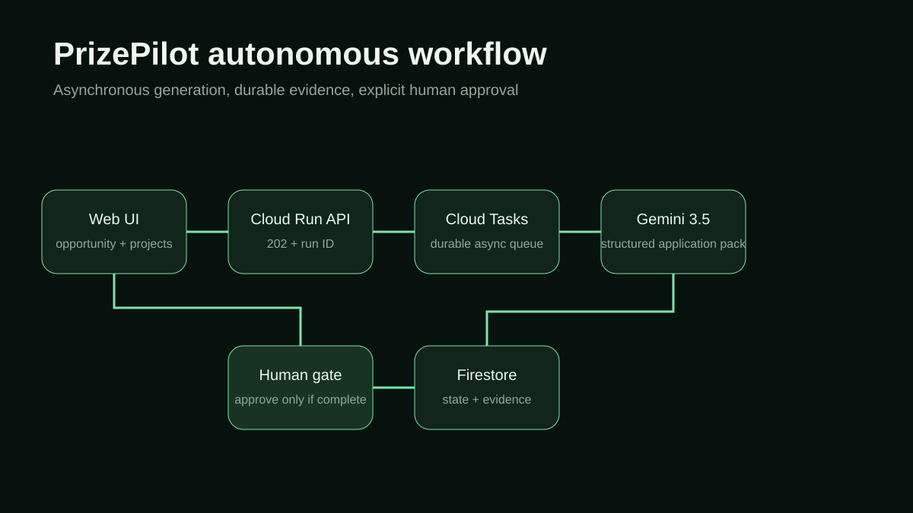

# PrizePilot Autonomous Application Agent

PrizePilot Agent turns a competition opportunity and a portfolio of real projects into an evidence-bound application pack. It runs the heavy evaluation asynchronously, exposes every blocker, and stops at an explicit human approval gate. It never claims that a form was submitted and never converts missing evidence into a capability.

## Why it exists

Founders waste time repeating the same portfolio facts across funding and hackathon forms. Worse, pressure to apply broadly can turn uncertainty into unsupported claims. PrizePilot makes the reusable part automatic while keeping eligibility, legal attestations, purchases, travel, and final submission under human control.

## Contest-period work and prior concept disclosure

The idea of a personal opportunity tracker and its portfolio data model existed before the All Things Agentic submission period. This repository is a new, independently implemented autonomous service created during the submission period. No prior tracker source code was copied. The new work is the asynchronous Gemini evaluation pipeline, Cloud Tasks orchestration, Firestore run ledger, evidence contract, approval policy, UI, tests, deployment configuration, and architecture.

## Google runtime

- **Gemini 3.5 through `@google/genai`** produces a structured application pack.
- **Google GenAI SDK** is imported and called in `src/agent.ts`.
- **Cloud Run** hosts the API, worker endpoint, and review UI.
- **Cloud Tasks** provides durable asynchronous execution.
- **Firestore** stores the complete run state, result, blockers, and approval timestamp.

The default local mode uses a clearly labelled fixture agent. It demonstrates the workflow without claiming a cloud or Gemini result. Competition-valid operation uses the Google runtime above.

## Safety and product behavior

1. The API validates one opportunity and one or more project profiles.
2. It returns `202 Accepted` and queues a durable worker task.
3. Gemini selects the strongest truthful match and returns structured JSON.
4. Firestore records eligibility, evidence, missing proof, source URLs, and human actions.
5. Approval is rejected unless eligibility is `eligible` and both blocker lists are empty.
6. Approval changes only PrizePilot state. It never submits to a third-party competition.

## Local demo

Requires Node.js 22+.

```bash
npm install
npm run check
npm test
npm run demo
LOCAL_DEMO=1 npm run dev
```

Open <http://localhost:8080>. The UI explicitly says `Safe fixture mode — no external action`.

## Deploy to Google Cloud

```bash
gcloud auth login
gcloud config set project YOUR_PROJECT_ID
gcloud services enable run.googleapis.com cloudtasks.googleapis.com firestore.googleapis.com aiplatform.googleapis.com artifactregistry.googleapis.com cloudbuild.googleapis.com
gcloud artifacts repositories create prizepilot --repository-format=docker --location=us-central1
gcloud tasks queues create prizepilot-runs --location=us-central1
gcloud builds submit --config cloudbuild.yaml --substitutions=_REGION=us-central1
```

After the first deployment, set `TASK_SERVICE_URL` to the Cloud Run service URL and grant the service account the minimum roles needed for Vertex AI, Cloud Tasks, and Firestore. For production, require authenticated Cloud Tasks requests on `/internal/*`; the public demo configuration is intentionally minimal for judging.

## Architecture



## Repository map

- `src/agent.ts` — live Gemini 3.5 / Vertex AI agent call
- `src/queue.ts` — Cloud Tasks orchestration
- `src/repository.ts` — Firestore and local repositories
- `src/policy.ts` — evidence prompt and approval gate
- `src/service.ts` — lifecycle state machine
- `public/` — review UI and sample input
- `test/` — policy and workflow tests

## Known limits

- The sample is synthetic and never proves contest eligibility for a real project.
- Source URLs are evidence pointers, not independent verification.
- Legal attestations and final third-party submission remain user actions.
- The local fixture deliberately ends in `needs_review` and cannot be approved.
